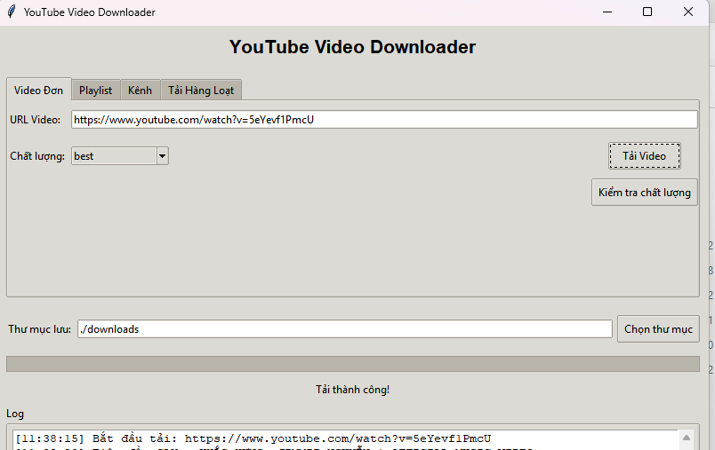

# YouTube Video Downloader

Phần mềm hỗ trợ tải video từ YouTube nhanh chóng, dễ sử dụng và hoàn toàn miễn phí.

---

## 🚀 Tính năng chính

- Tải video YouTube đơn lẻ, playlist, kênh, hoặc tải hàng loạt video.
- Lựa chọn chất lượng video trước khi tải về.
- Cho phép thay đổi thư mục lưu video.
- Giao diện thân thiện, dễ sử dụng.
- Hiển thị trạng thái tải và log chi tiết.

---

## 🖥️ Hướng dẫn sử dụng

### 1. Tải video đơn lẻ

#### Bước 1: Nhập link YouTube
- Dán đường link video vào ô **URL Video**.
  - Ví dụ: `https://www.youtube.com/watch?v=5eYevf1PmcU`

#### Bước 2: Chọn chất lượng video
- Chọn chất lượng mong muốn từ menu thả xuống (mặc định: `best`).

#### Bước 3: Chọn thư mục lưu
- Mặc định video sẽ lưu vào thư mục `./downloads`.  
- Có thể thay đổi bằng nút **Chọn thư mục**.

#### Bước 4: Tải video
- Nhấn nút **Tải Video** để bắt đầu tải.

#### Bước 5: Kiểm tra trạng thái
- Trạng thái sẽ hiển thị dưới dòng **Tải thành công!**
- Log chi tiết quá trình tải sẽ hiện ở khung **Log** phía dưới.

---

### 2. Các tính năng khác

- **Playlist:** Tải toàn bộ video trong playlist.
- **Kênh:** Tải video từ một kênh YouTube.
- **Tải hàng loạt:** Dán nhiều link video để tải cùng lúc.

---

## ⚠️ Lưu ý

- Đảm bảo máy tính của bạn có kết nối Internet.
- Một số video có thể bị giới hạn tải do bản quyền hoặc hạn chế từ YouTube.
- Nếu gặp lỗi, hãy kiểm tra lại đường link hoặc thử chọn chất lượng khác.

---

## 💻 Ảnh giao diện

---

**Chúc bạn sử dụng phần mềm hiệu quả!**
